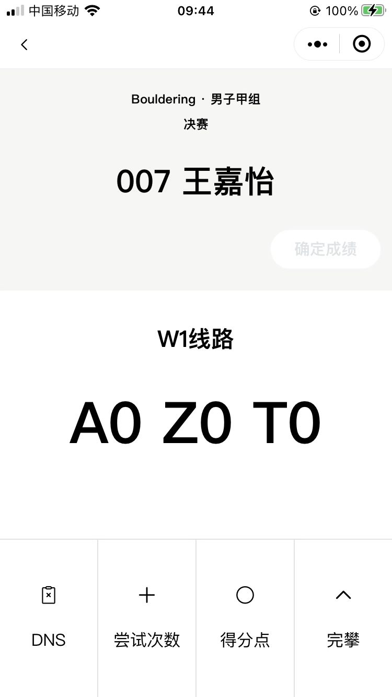
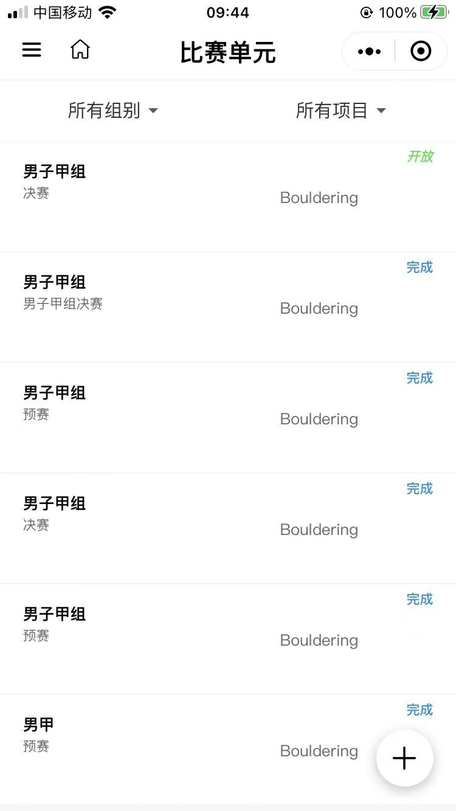
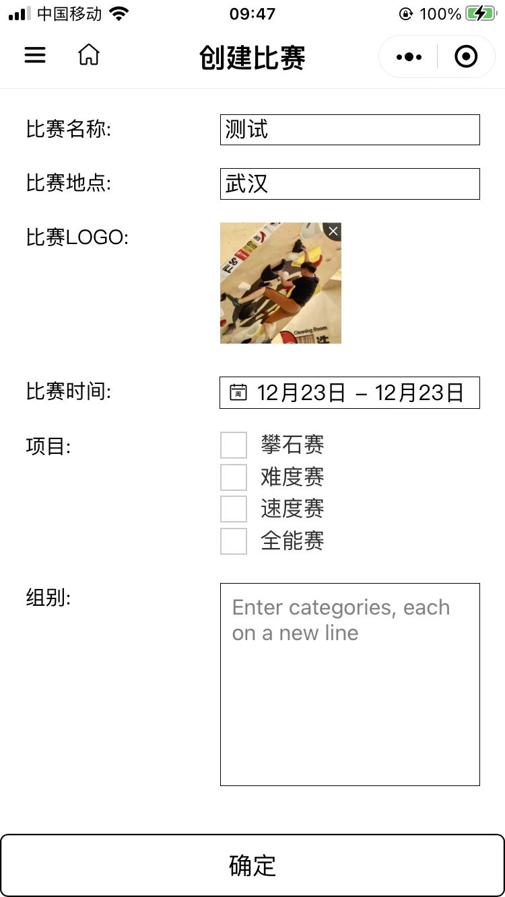
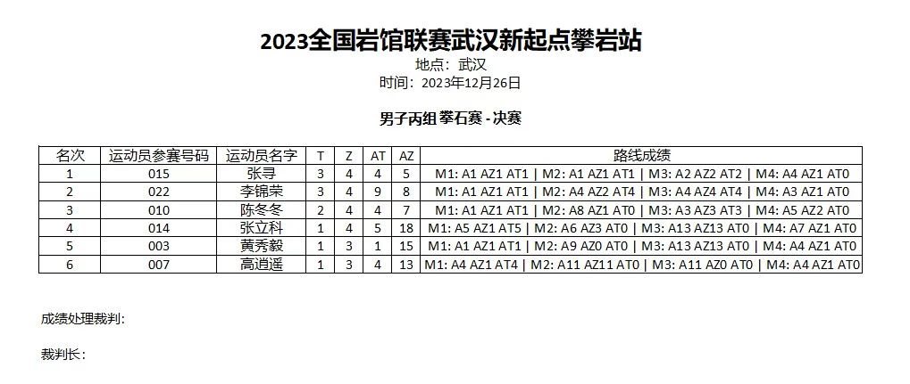
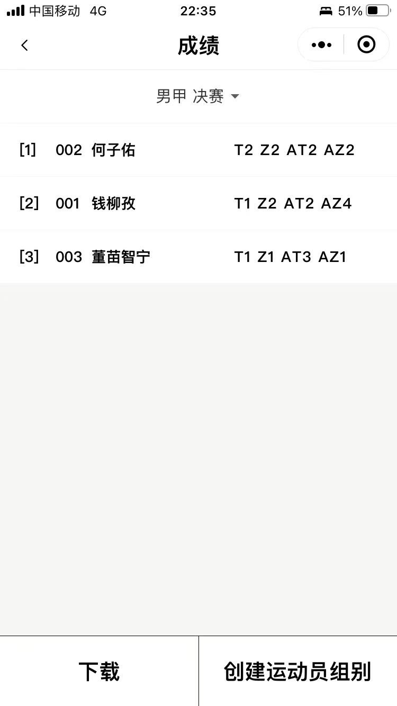
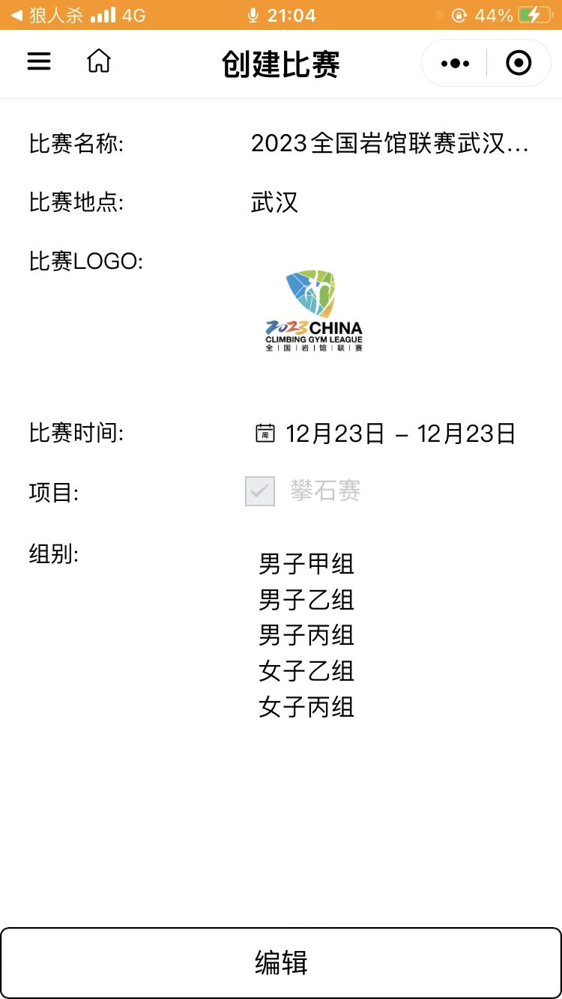
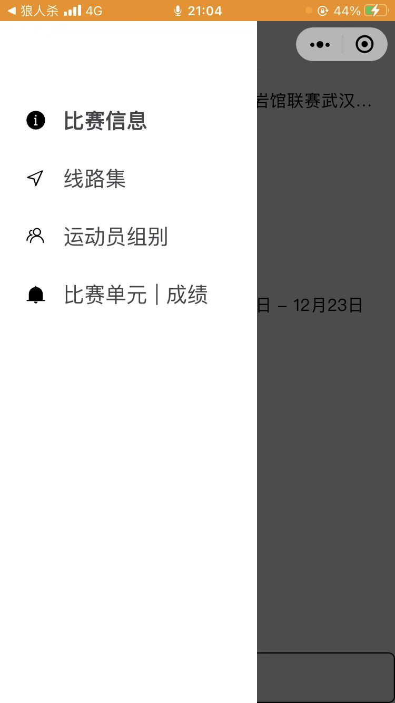

# RockRank

A WeChat Miniprogram tracking scoring and processing of results for rock climbing competitions for judges.

## Features

- Bouldering, Lead, and Speed Scoring
- Admin interface to create competitions and input competition information
- Excel file results generated after scores are finalized

## Screenshots

    

    

    

    

    

    

    

    

